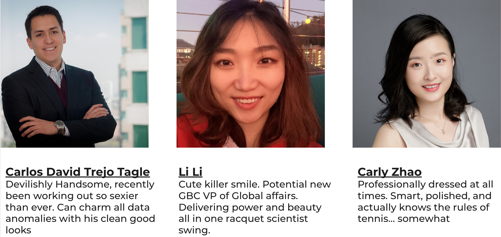
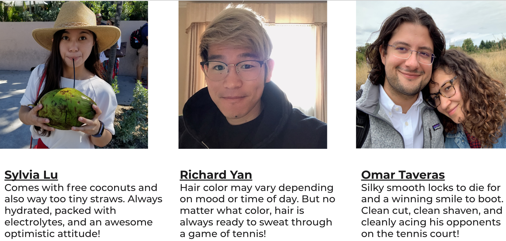

<h1 align="center"> Racquet Scientists </h1>  

  
  
  

  Predicting all that is Tennis! Built with R.

  

  

  

## Table of Contents

- [Introduction](#introduction)
- [The Team](#the-team)
- [Reasoning](#reasoning)

## Introduction
Using our Machine Learning Skills masterfully honed and crafted through the University of Chicago Booth's BUSN 41204 Machine Learning Course, we want to present a predictor of the winners and LOSERS of the upcoming French Open

## The Team

## Reasoning(Under Construction...)
